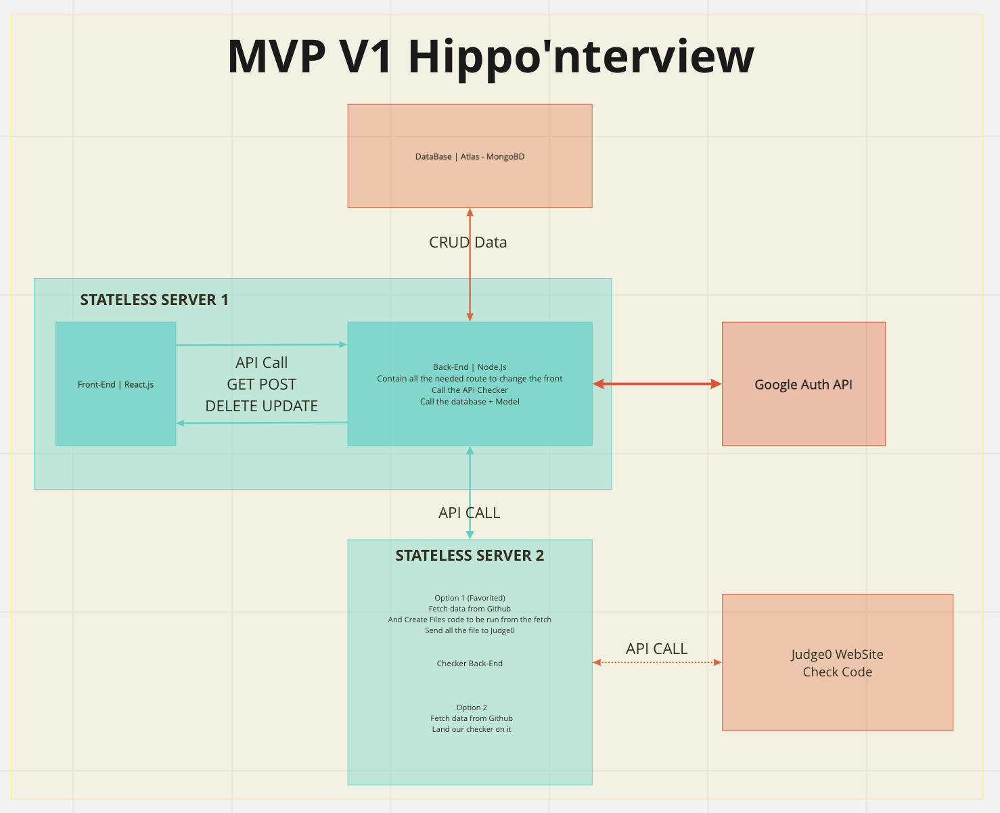

# Hippo'nterview

Version 1.1.1

## Description

The main goal of Hippo'nterview is to give to all Holberton School's students a tool to be ready for cooding interview.
The tool is separate in two part:

- The full partern course
- The random question

The full patern course have been based on the [blog post](https://www.techinterviewhandbook.org/best-practice-questions/) of a ex FaceBook recruiter.

There are some other platforms which offers the same service, but with Hippo'nterview, all the solutions are free for holberton school students, and work on the same way as the school.

## Installation & Usage

Clone the repo.

```
git clone git@github.com:Camaltra/portfolio-project.git
```

Create a .env file at the root of the server and server-checker folders, with:

- server-checker (API key for the [judge0 API](https://judge0.com)):
  - X_RAPIDAPI_KEY
  - X_RAPIDAPI_HOST
- server
  - Google Cloud Auth
    - CLIENT_ID
    - CLIENT_SECRET
  - Mongo Database
    - MONGO_URL
  - Coockie session key
    - COOKIE_KEY_1
    - COOKIE_KEY_2

Then, for now, there is not global installation and server starting. So go to each server, server-checker, client and run `npm install`. To finish, just start each server in a terminal with `npm run watch` for the two server side, and `npm run start` for the client side.

A futur script will be added a the end of the project to join all these operations into a single one.

## Architecture



All the architecture is based on a MVC model, and use differents externes tools, as Atlas Mongo DB, Judge0 API and google auth.

## Bugs

Not bugs know from the API V1. If you discover any bug, feel free to reach me, so I'll find a way to fix it.

Bug on the front-end part, Modal of checking tasks not really good align on the center-center of the page

## Contributing

Pull requests are welcome. For major changes, please open an issue first to discuss what you would like to change.

Please make sure to update tests as appropriate.

## License

[MIT](https://choosealicense.com/licenses/mit/)
